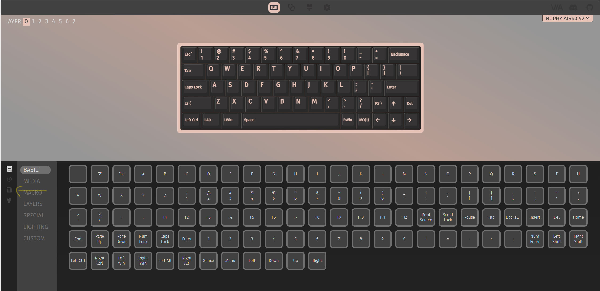
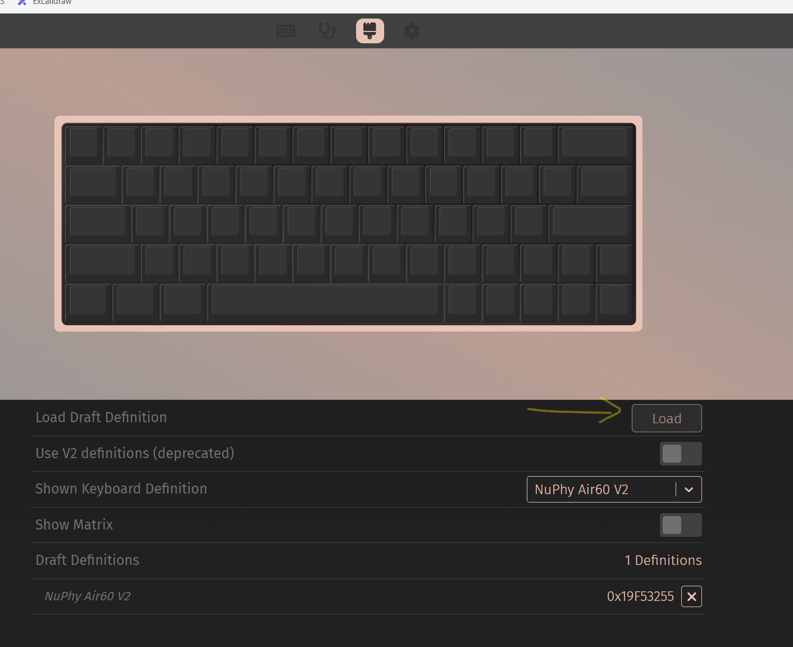
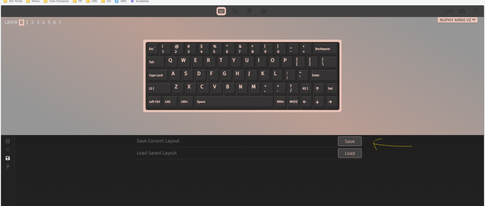
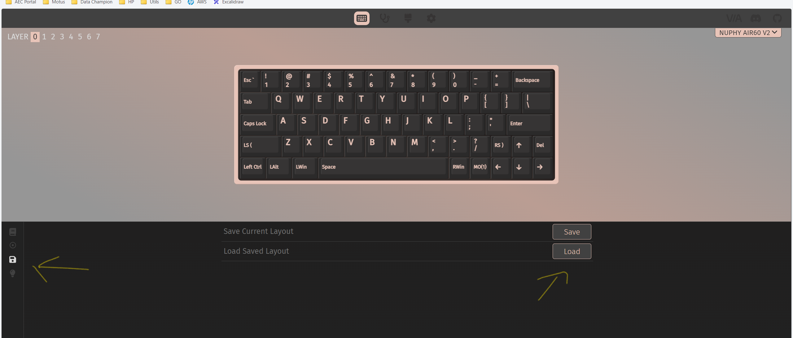

# Instructions

1. Navigate to [VIA web page](https://usevia.app/).

2. Select Nuphy keyboard.

3. Enable design tab. Go to settings and select S option how Design tab `Settings tab > Show Design tab`.

4. From the design tab load keyboard VIA layout `nuphy-air60-v2-via.json`.

5. From the configure tab load keyboard custom layout configuration `nuphy_air60_v2.layout.json`.

6. If the layout has been modify, upgrade the `nuphy_air60_v2.layout.json` file from the this repository.

