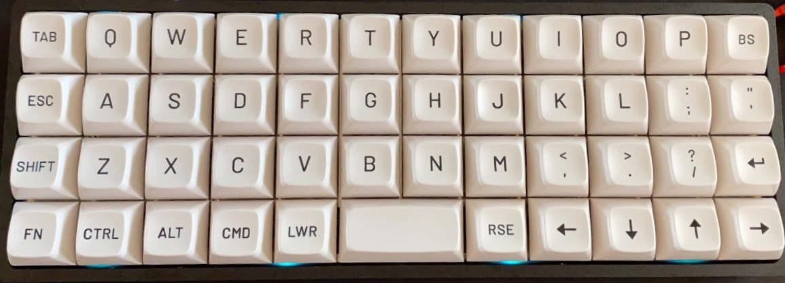

<h2 style="
    text-align: center;
    font-weight:200;
    font-size: 28px;
    text-transform: uppercase;
">Carseven Custom Planck Layout</h2>
<p align="center">
    
</p>

## Install qmk

For macos:

```bash
brew install qmk/qmk/qmk
```

For other OSS follow [QMK Getting Started](https://docs.qmk.fm/#/newbs_getting_started)

## Compilation and flashing

Copy files to your local qmk installation folder:

```bash
cp -r . qmk_firmware/keyboards/planck/keymaps/carseven
```

Compile planck carseven layout..

```bash
qmk compile -kb planck/rev6 -km carseven
```

Flash planck carseven layout.

```bash
qmk flash -kb planck/rev6 -km carseven
```
