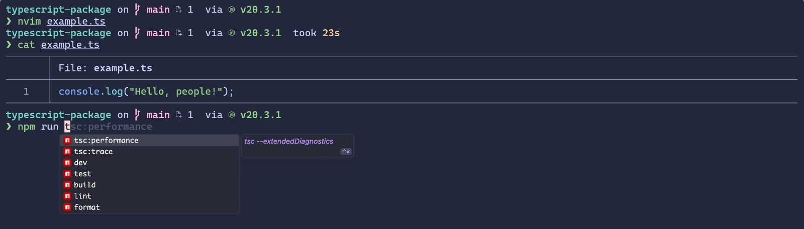

<h2 style="
    text-align: center;
    font-weight:200;
    font-size: 28px;
    text-transform: uppercase;
">Dotfiles</h2>

    

# Installation guide

Reference/Inspiration: https://github.com/TechDufus/dotfiles/tree/main

## TODO

- [] Start basic configuration

- Configure ZSH history https://registerspill.thorstenball.com/p/which-command-did-you-run-1731-days and find a way to share between computer.
- Optimize shell start time https://registerspill.thorstenball.com/p/how-fast-is-your-shell

- Manual settings Macos:
  - Change spotlight keyboard shorcut (Preferences > Keyboard > Shortcuts) ->
    None
  - Change input sources keyboard shortcut -> None
  - Import raycast settings
  - Activate night shift
  - Install brave extensions: Notion Web CLipper and Bitwarden
- Vscode layout
  - Add problems to the right bar
  - Remove editor open tabs from right bar
  - Remove not need options from terminal bar, left bar and right bar :)
