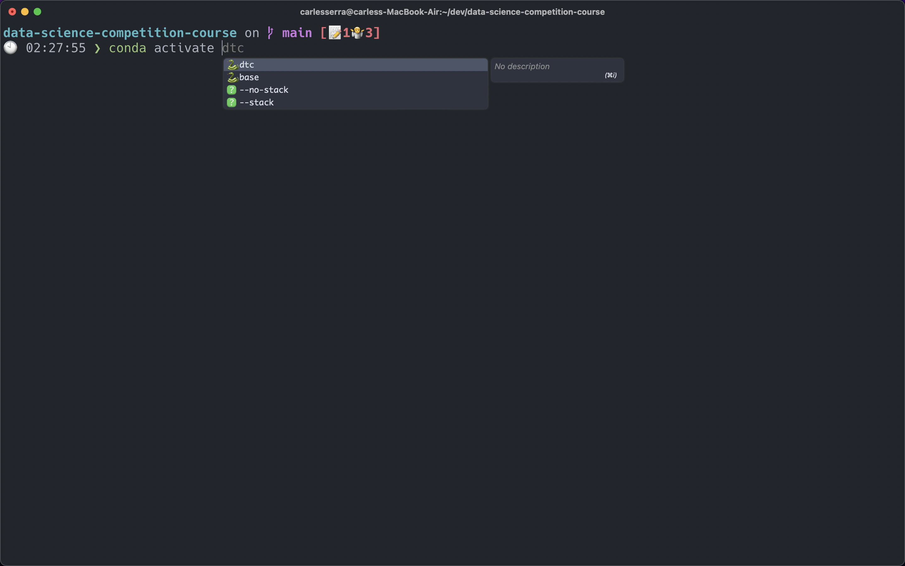

<h2 style="
    text-align: center;
    font-weight:200;
    font-size: 28px;
    text-transform: uppercase;
">The perfect dev setup</h2>

    

# Installation guide

- Open terminal
- Execute
  `curl https://raw.githubusercontent.com/carseven/.dotfiles/main/setup/setup.sh | sh`

- Manual settings:
  - Change spotlight keyboard shorcut (Preferences > Keyboard > Shortcuts) -> None
  - Change input sources keyboard shorcut -> None
  - Import raycast settings
  - Activate night shift
  - Dock add permanent programs: iTerm 2, Visual studio code, Notion, Safari, Mail, Calendar
  - Install brave extensions: Notion Web CLipper and Vimium
  - Import raycast settings file
  - Install vim plugins :PlugInstall
  - Install tmux plugins Prefix + I (Capital I)

# TODO

- Fix none 0 stand out macos.sh
- Test ansible playbook on a brand new macos installation.
- Add ssh config and encrypted files workflow (Personal Github)
- Create ansible-playbooks to automate common repetive task.
- Create angular basic app (eslint, prettier, stylelint, basic CI/CD, etc)
