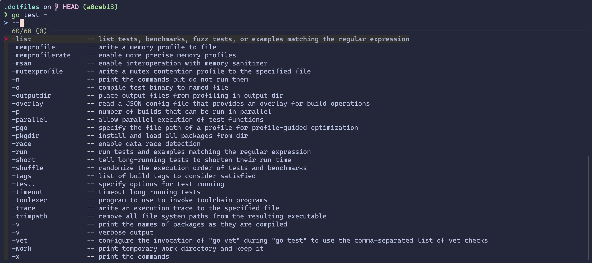
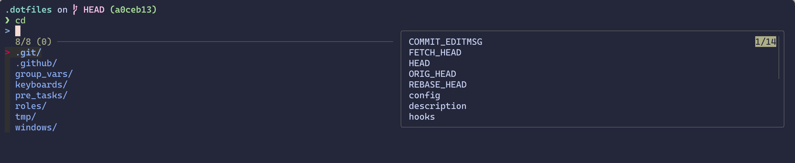
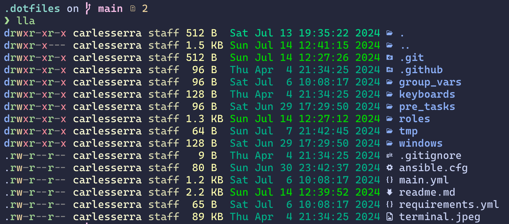
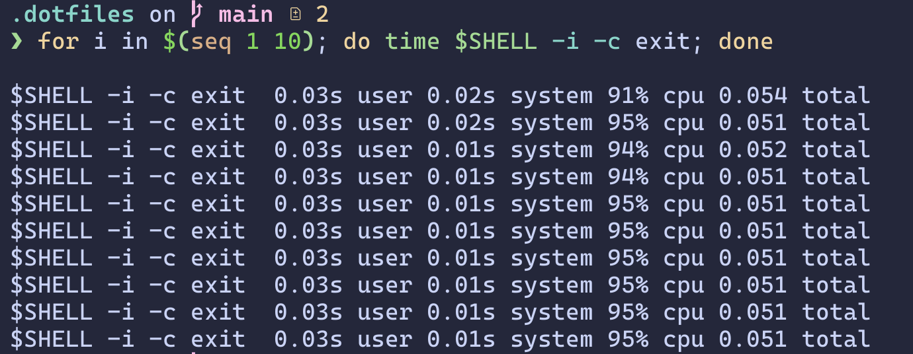

<h2 style="
    text-align: center;
    font-weight:200;
    font-size: 18px;
">Beautiful, easy and quick dotfiles</h2>
<p align="center">
    
    
    
</p>

## Install

### Development

Install shellcheck

```sh
brew install shellcheck
```

Install shfmt

```sh
brew install shfmt
```

Install prettier and prettier

### Macos setup

Install brew package manager. [Brew documentation](https://brew.sh)

```shell
/bin/bash -c "$(curl -fsSL https://raw.githubusercontent.com/Homebrew/install/HEAD/install.sh)"
```

Export path of brew to be able to use brew binary

```shell
export PATH="/opt/homebrew/bin:$PATH"
```

### Ubuntu setup

Update and install basic packages for using apt.

```shell
sudo apt update
sudo apt install software-properties-common
```

### Launch install scripts

The following commands requires to be run from .dotfiles root directory from the repository ~/.dotfiles

```shell
./run
```

Using the first argument you can launch only specific scripts. This is really useful to update changed configuration without running all the scripts, because we are not using symlinks to be idempotent. To update changes, we need to launch again the scripts.

```shell
./run vscode
```

## Features

### Zsh shell

#### Shell benchmarks

```shell
for i in $(seq 1 10); do /usr/bin/time $SHELL -i -c exit; done
```

<p align="center">
    
</p>

## Documentation

Documentation for things that are not automated.

- [Windows dotfiles](./doc/windows/readme.md)
- [Nuphy Keyboard](./doc/keyboards/nuphy-air60v2/readme.md)
- [Planck Keyboard](./doc/keyboards/planck/readme.md)

### Roadmap

- Setup docker to test clean installs (Linux and macos)

- Create a install script to clone and install basic dependencies and launch run script. Idea `curl `

- Automate sudo, ask at the beginning of the script only.

- Prettify logs and error handling (Better show when script errors, maybe finish script execution?)

- Test scripts using docker or VM and CI to check that everything runs smooth. First launch the script and check everything goes well. Use ansible with a test flags to run some steps just for CI environment or for testing

## References
